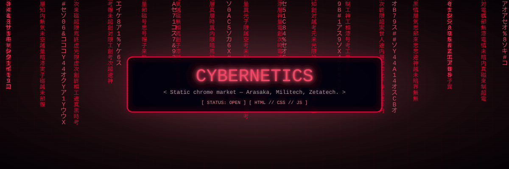
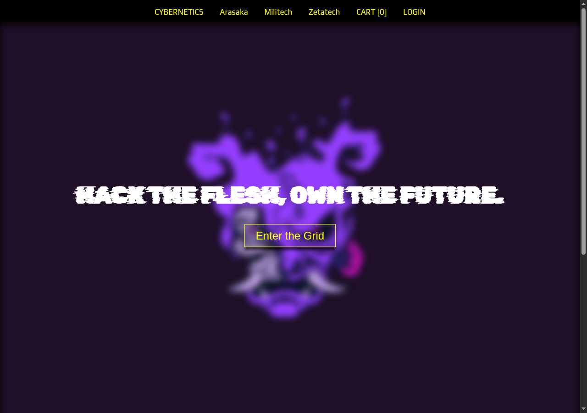
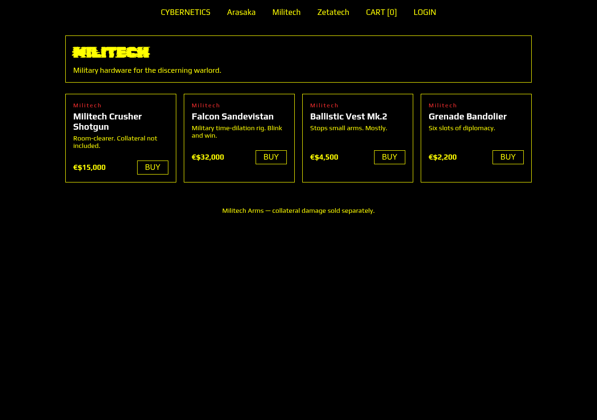

<div align="center">
  
</div>

<h1><a href="https://rv2hex.github.io/fullstack/" target="_blank">CYBERNETICS — chrome market</a></h1>

A static cyberpunk buy/sell storefront. Three corp catalogs (Arasaka,
Militech, Zetatech), cart, mock login, mock checkout — **no backend**,
everything persists in `localStorage`. Open it and shop.




## Run

No build. Serve the folder (or just open `index.html`):

```sh
python3 -m http.server 8000
# visit http://localhost:8000
```

## Pages

| Page | What |
|---|---|
| `index.html` | Hero + featured chrome |
| `Arasaka.html` / `Militech.html` / `Zetatech.html` | Corp catalogs (4 products each, rendered by `script.js`) |
| `cart.html` | Quantities, totals, drop-details form, mock checkout → order id |
| `login.html` | Register / sign in (mock, local only) |

Prices in €$ (eddies). Checkout works as guest; signing in stamps your
handle on the order.

## How it works

- `script.js`: `PRODUCTS` catalog, cart store (`cyb_cart`), mock users +
  session (`cyb_users`, `cyb_session`), orders (`cyb_orders`), catalog/cart/
  checkout renderers, toast notifications.
- `styles.css`: original black/yellow Play + Rubik Glitch theme, extended
  with cards, cart table, forms, toast, footer.
- Auth is **demo-grade** (base64-obfuscated passwords in localStorage) —
  never real security. No data leaves the browser.

## Add a product

Append to `PRODUCTS` in `script.js`:

```js
{ id: "zet-new", corp: "zetatech", name: "Neural Lace", price: 5000, blurb: "..." },
```

It appears on that corp's page automatically.
